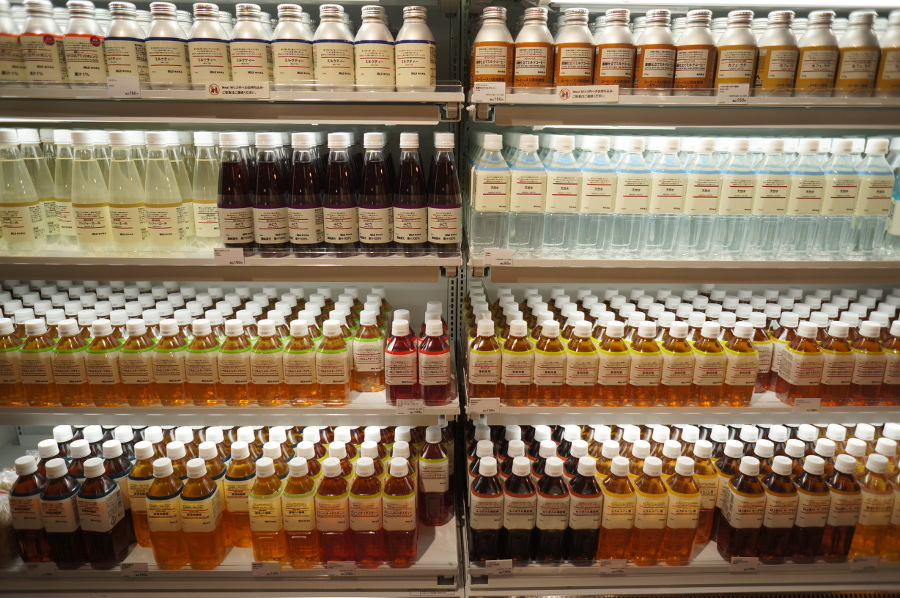
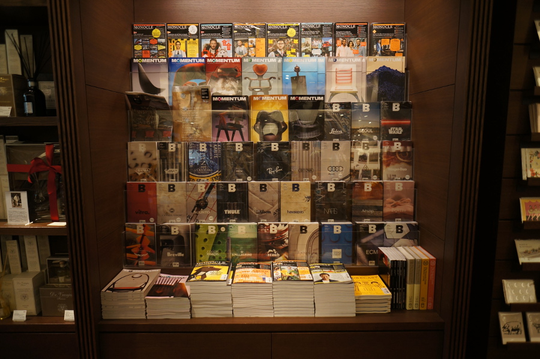

## 매거진 B MUJI & ACE HOTEL 독후감

**균형잡힌 브랜드**

매거진 B 를 처음 접한 것이 MUJI 편을 통해서였다.
재밌게도 마케팅 실버를 놀러오려고 보니 이 책이 발제로 되어있어서 뭔가 맞아떨어진 듯한 느낌으로 읽기 시작했다.

무지 편에는 없지만 에이스 호텔 편의 뒤를 보면 "매거진 <B>는 전 세계에서 찾은 균형 잡힌 브랜드를 한 호에 하나씩 소개하는 광고 없는 월간지입니다."라고 써있다.
'균형 잡힌 브랜드'라는 것은 뭘까. 막연하게 "그래 그건 좋은 브랜드지"라는 생각은 많이 하지만 균형잡힌 브랜드라는 것에 대해서는 생각은 해보지 않은 것 같다.
좀 찾아보니 "그 균형의 기준은 아름다움, 실용성, 합리적인 가격 그리고 브랜드의 의식입니다."라는 문구를 발견할 수 있었지만 이렇게 놓고 보니 멋있지 않아서, 내가 무지, 에이스 호텔 이 두 권을 보며 짧게 느낀 바로는 "스스로 오롯이 잘 서있는" 브랜드로도 표현할 수 있지 않을까 생각해본다.

#### MUJI

이 책을 처음봤을 때는 가볍게 이런것도 있네 하며 읽어서 그렇게까지 와닿는 것은 없었지만
트레바리 지난 시즌에 트래블코드와 함께하는 트래블리를 통해 무지에 대해 공부하고 무지 유라쿠초점도 다녀오고나서 이 책을 다시 보니 새롭게 다가오는 것이 많다.
그 때는 무지보다는 츠타야에 초점을 맞췄었고, 이제와서 이 책을 읽으며 생각해보니 나는 츠타야는 왜 다른가에 집중해 있었기 때문에 무지를 무지답게 즐기지 못했던 느낌이 있다. 그래도 이 책을 읽으며 이렇게 복기를 할 수 있어 다행이다.

무지 매장에서 찍었던 사진인데, 단지 진열된 음료들일 뿐인데도 아름다움을 느끼게 하는 이유는 무지 특유의 담백한 디자인과 그 디자인이 실제로 모든 제품을 관통하고 있다는 점 때문이라 생각한다. 어떤 브랜드를 나타내는 고유의 디자인을 만드는 것도 쉬운 일은 아니지만, 그것을 이렇게 모든 제품군에 어울리게 녹여내는 것은 무지가 왜 단지 브랜드가 아니라 철학이라고까지 자신들을 말할 수 있는지 보여준다.

나는 음악을 좋아해서 무지의 광고 음악을 만든 하스누마 쇼타의 인터뷰를 보고는 무지 광고를 보지 않고 넘어갈 수 없었다. (정작 광고 만든 아베 요스케의 인터뷰는 쓱 지나갔었는데!)
다 같이 봤으면 좋겠어서 몇가지를 가져왔다.

What is MUJI?

Compact Life

먼저 음악 때문에 보기 시작했으니 이에 대한 감상을 얘기하면 '잔잔함 속의 두근거림'이다. 조용한 연못에 떨어지는 빗방울 같은 느낌? 그런 면에서 자연스러운 디자인으로 일상의 작은 두근거림을 주는 무지의 제품들과 정말 잘 어울린다고 생각한다. 앞으로 내가 무지를 말할 때 쓰는 표현이 될듯.

이렇게까지 소비자의 모습들 담아낸 광고를 본 적이 없어서 굉장히 많은 생각을 하게 되었다.
일본에 갔을 때 가장 많이 느낀 것은 디테일이었는데, 디테일은 중심을 잡고 있는 '목적'이 있어야 가능하고, 그 목적은 정확히 왜인지 드러나든, 아니면 단지 뭔가 의도가 있구나 하고 느껴지기만 하든 사람들로 하여금 고개를 끄덕거리게 만드는 면이 있다.
무지의 광고에서 나타나는 디테일 또한 그렇다. 아 저래서 저렇게 만들어졌구나, 저렇게 쓰는 물건이구나 하고 자연스럽게 받아들이게된다.
무언가를 만들었을 때 다들 소비자를 생각했다고 하지만, 무지와 비교하면 그냥 마음대로 만들어놓고 가져다 쓰라고 하는 수준인거 아닌가?라는 생각까지 들게 했다.

중간에 의외의 감명을 받은 것은 What is MUJI? 3:52 에 나오는 Training Paj 였다. 이 물건은 어린이들을 위한 잠옷인데, 광고에 나온 물품 중에 유일하게 유채색 + 패턴이다. 즉, 처음 보기에 무지 제품 같지 않다. 하지만 이 광고 속에 무지의 수많은 제품들 중 저 옷을 굳이 넣은 것은 그 것이 무지가 생각하는 무지의 모습이기 때문이라 생각한다.
(이하 내용은 꿈보다 해몽일까?)
무지가 생각하는 무지는 자신들의 디자인에 제품을 끼워넣는 것이 아니라, 철저하게 사용자에 맞춰 자신들의 철학을 자연스럽게 받아들이도록 하는 모습이다. 아이들에게도 무채색의 패턴없는 옷을 입힐 수 있지만 그것이 무지가 얘기하는 '자연스러움'과 어울리냐 생각하면 그렇지 않은 것이다. 아이들은 색을 좋아하고 패턴을 좋아하니까.
그래서 무지는 자신들의 철학이 담긴 유채색 패턴옷을 만들었고 그것을 당당하게 자신들의 광고에 보여주었다. 이것이 무지의 본질이다라고. "철학을 지속해서 상품화한다" 라는 말을 스스로 증명한다.

지난 시즌 트레바리 트래블리를 하며 <지적 자본론>, <넨도 디자인 이야기> 등을 읽으며 '목적'에 대해 많은 생각을 했다.
목적이 중요한 것은 길이 막혔을 때 다시 돌아가서 새로운 길을 찾아 떠날 수 있는 출발점이 되어주기 때문이다.
목적과 수단이 도치되어버리면 수단을 붙잡고 놓지 못하게 되고, 막다른 골목에 왔을 때 그 길에 묶여 뒤로 돌아가지 못한다.

무지는 2000년대 들어 '이유가 있어 저렴하다' 에서 '이것으로 충분하다'로 변하는 과정을 겪었지만
그럼에도 '자연, 당연, 무인'이라는 30년 전 광고카피를 다시 쓸 수 있었다.
이는 저 두 가치를 관통하는 목적이 무지에게 있었고, 그랬기에 성공적인 변화가 가능했다고 생각해 볼 수 있게 하는 부분이다.

그렇게 단단한 목적이 있으면 이끌리는 사람들이 있기 마련이다.
이것은 특히 무지의 어드바이저리 보드에서 느낄 수 있는데, 직원도 아닌 사람들이 시간을 내어 다른 브랜드의 발전을 위해 머리를 짜내는 모습이 정말 신기하게 느껴졌다.
이렇게 운영하려 하는 다른 브랜드도 많이 있겠지만, 무지의 경우에는 마치 오픈소스 생태계의 오프라인 버전을 본 것 같달까. 돈을 뛰어넘는 무언가가 있어 보였다.

무지에 대해 몇 가지 남는 의문이 있는데, 첫번째로 무지의 시스템화. 강한 시스템화는 일반적으로는 창의력을 억제한다든지 하는 이유로 부정적 뉘앙스를 가지게 되는데, 무지의 경우는 어떻게 이를 통해 회사를 다시 세울 수 있었는지가 궁금하다. 그래서 <무인양품은 90%가 구조다>라는 책을 읽어보려한다.
두번째는 무지의 목적이 1970년대 일본의 과함에 대한 '반'으로 나왔기 때문에 시대를 무시할 수 없다고 생각하는데, 앞으로의 시대에서 무지가 '정'이 되고 나면 이에 대한 또 다른 '반'이 나오지 않을까라는 의문이다. 무지가 인간의 두 가지 상반된 욕망 중 한쪽을 충족시킨다고 했지만 그것이 정말 시대를 뚫고 나갈 수 있는 인간 본연의 욕망일까?

#### 에이스 호텔

에이스 호텔은 내가 직접 겪어본 브랜드가 아니여서 포틀랜드에 사는 지인에게 에이스 호텔을 아냐고 물어봤더니 가본적은 없지만 1층 커피집이 로컬이고 리셉션이 오픈이라는 건 안다고 했다.
부띠끄 호텔은 많다. 그럼에도 매거진 B 에서 에이스 호텔을 고른 것은 에이스 호텔이 균형잡힌 브랜드인 이유가 단지 부띠끄 호텔인 것은 아니기 때문이었을 것이다.

"다른 이들의 평가보다는 브랜드를 만드는 이들이 가장 좋아하는 라이프스타일에서 비즈니스가 출발했으며, 스스로가 즐기는 순수하고 행복한 모습을 통해 브랜드를 성장시키고 있다는 것입니다."
알렉스 콜더우드가 좋아하던 것은 파티였다.
에이스 호텔은 좋아하는 사람들, 그리고 새로운 사람들 모여 즐기는 파티를 로컬과 1층의 오픈으로 표현해냈다.

그런 라이프 스타일을 좋아하는 사람들에게는 쉽게 즐길 수 있는 길을 열어주고, 그렇지 않은 사람들에게는 편안하게 소개시켜주는 곳 같은 느낌을 받았다.
더불어 로컬과 브랜드의 조화는 통일감 속 새로움이 일으키는 수집욕의 묘한 매력이 있다.
한 번 맛들이면 헤어나오지 못할 호텔로 머리 속에 남겨둔다.

#### 매거진 B

도쿄의 츠타야 카덴에서 잡지들 가판대의 가장 좋은 자리를 가장 넓게 차지하고 있는 매거진 B 를 보며 엄청 놀랐다.

그동안 우리나라의 지적 컨텐츠가 외국에서 먹히는 것을 본적이 거의 없었다.
개발분야는 늘 외국 컨텐츠를 찾는 것이 당연했고 책도 어떤 분야에 대해 더 깊게 알고 싶으면 당연하게 외국 번역서를 찾아보게 되었는데, 해외 서점에서 당당히 자리를 차지하고 있는 우리나라 다큐멘터리 잡지라니.

이번에 보면서 재밌는 것은 매거진 B 가 브랜드를 담아내는 방식이 무지가 제품을 대하는 방식과 비슷하다는 것이다.
무지는 철저하게 사용자가 어떻게 사용할지를 생각해 제품을 만들고, 제품 광고를 만들 때도 사용자가 실제로 사용하는 모습을 담아 무지를 표현한다.
일반적으로 브랜드다! 생각하면 그 브랜드 대표의 이야기와 숫자를 떠올리기 쉽지만 매거진 B 도 사용자들과 주변인들을 시작으로 그 브랜드가 사용되는 모습 그리고 사용하는 사람들의 생각을 통해 브랜드에 다가가고 나중에서야 대표와 숫자가 나오는데, 이 둘의 철학이 꽤 맞닿아 있구나라는 생각을 했다.

일반적인 구성을 탈피하고, 브랜드로부터 돈을 받지 않고, 잡지라면 당연히 있어야할 것 같은 광고도 넣지 않고
오로지 착실한 내용으로 승부를 보려한 매거진 B 는 그 스스로도 균형잡힌 브랜드가 되어가고 있지 않나 싶다.
