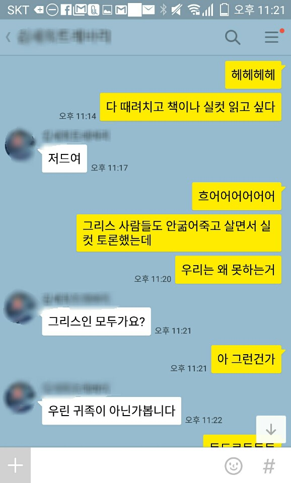

## 삼미 슈퍼스타즈의 마지막 팬클럽 독후감

그 이유에 대해 핑계를 대보자면 이것저것 생각해 볼 수는 있겠지만은
그리스 시대의 가장 풍족한 사람 만큼의 삶도 보장되지 않는 현실은
우리가 그렇게 외치는 발전이라는 것이 도대체 어디서 무엇을 하고 있는 것인지. 이거 배임 아닌가? 의문을 제기하게 하는 것이다.

많은 사람들이 긴 시간 동안, 그리고 나도 내 삶 동안 뭔가 한다고 열심히 했는데
그리스 시대의 귀족이 현대의 나보다 잘 사는 것 처럼 느껴진다면
결국 주인공이 '소속'이며 '계층'이며 했던 말이 사실인가 싶다가도
아니면 그들은 프로- 를 포기하고 삼미의 길을 선택할 수 있었던 용기가 있었던건가
나는 그러면 왜 못하는거지 나를 붙잡고 있는 것은 무엇이지.

돈!
부정하고 싶지만 돈이다.

얼마전 투자에 손을 대면서 2주 동안 내 월급의 3배를 얻게 되었다.
뭐지 이건?
그 동안 내가 한 것은 몇 번의 클릭질이 전부인데.
흔히 투자의 수익에 대해 '리스크'에 대한 보상이라고 하는데
내가 그 동안 클릭질 하며 뭐 얼마나 대단한 리스크를 졌는가 생각해보면
그렇다면 출근길에 차에 치여 죽을 리스크나
일하다가 과로로 숨져 놀지도 못하고 죽어버릴 리스크
혹은 로우 리스크를 바란답시고 리스키하게 날려버린 시간에 대한 보상은 얼마인가.

더구나 돈 없는 사람들에게는 천 만원을 투자하는 것이 인생을 거기서 끝낼 수도 있는 리스크이지만
돈 많은 사람에게는 일 억원을 투자하는 것이 이번 투자는 잘못골랐네 하면서 다른 투자를 찾아떠나게 만드는 정도의 리스크 밖에 되지 않는데.
하이 리스크 하이 리턴이라더니?
사람이 돈을 버는 것이 아니라 돈이 돈을 버는 것이라 사람의 기준이 아니라 돈의 기준에서 바라봐야 하는 것인가.
하기사 돈의 입장에서는 자신을 배불리 해주는 사람이 뭐하는 사람이든, 죽든 상관 없을 것이다.

그래 이렇든 저렇든 돈을 벌기 힘든건 그렇다 쳐.
그런데 왜 벗어날 수 없는거지?
사람이 사는데 필요한 것으로 의.식.주. 를 들으며 자라왔는데
옷이야 스티븐 잡스도 터틀넥에 청바지로 주구장창 입었고,
먹는거야 요즘은 덜먹기 위해 노력하는 사람들이 넘쳐나는 판국인데,
주. 내가 어디에 산다는 것은 왜 이리도 중요하게 느껴지는가.
나는 왜 시골동네에 내려가 싸고 좋은 집에서 살지 않는가.
아, 지방에 내려간다는 것은 좋은 일자리를 포기하고 그러면 좋은 수입을 포기하고 그러면 다시 서울에 집을 얻는 것도 포기하고. 나의 프로- 로서의 인생을 포기하고 영원히 아마추어로 살겠습니다. 라고 선언하는 것이 되어버려 다들 끝까지 붙잡게 되는 것인가.
그래서 서울의 집값은 이제 곧 떨어진다 이제 곧 떨어진다 해도 계속해서 오르는걸까.
그리고 우리는 어떻게든 그곳에서 살기위해 아둥바둥 버티는걸까.

이렇게 돈에 대한 생각에 이어 요즘 고민을 하고 있는 것이
실리콘벨리에서 넘어왔다는 스타트업 이라는 것인데
스타트업에서 일하고 스타트업을 하고 있는 입장에서
내가 이거 하는 것이 정말 내가 원해서 하는 것인가?
"야 그거 쿨한거야 힙한거야. 하고 싶은거 하고 멋지다."라고 말하는 세상 때문에 혹 한것이 아닐까?
100명이 하면 1명이 성공한다는데 세상의 발전을 위해 노력하다 갈려나간 나머지 99명은 행복하게 살고 있나?
그렇게 갈아넣어 다른 곳보다 빠르게 발전한 실리콘벨리가 세상 여기저기 프랜차이즈를 만들고 싶어하는 것이 아닐까?
생각을 하다보면 내가 이미 그 프랜차이즈의 가맹점주가 된 입장으로서 이제는 진실을 알 수 없기에 그저 믿고 가는 수 밖에 없다.

까지 생각하고 어지러운 머리를 느끼며 내일을 위해 자러가고 있을 것이다.
이 생각들은 오늘의 오늘도 했고 내일의 오늘도 하겠지만 언젠가 그만하게 된다면 그것은 무엇 때문일까?
