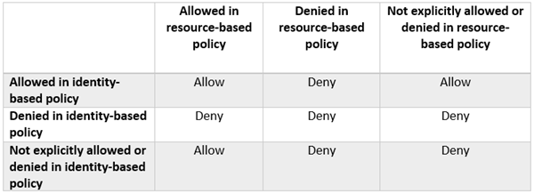

## How to Control Access to Amazon Elasticsearch Service Domain

Two ways

1. **Resource-based policies** - attached to an AWS resource, such as an Amazon S3 bucket.
* *IP* based.
* You can omit the *Principal*.

2. **Identity-based policies** - attached to an identity, such as an IAM user.
* *Principal* based.

### Resource-based policies

```json
{
  "Version": "2012-10-17",
  "Statement": [
    {
      "Effect": "Allow",
      "Principal": {
        "AWS": "*"
      },
      "Action": "es:*",
      "Resource": "arn:aws:es:<aws-region>:xxxxxxxx:domain/<es-domain>/*",
      "Condition": {
        "IpAddress": {
          "aws:SourceIp": "<ip-to-allow>"
        }
      }
    }
  ]
}
```

You can add *Principal* restriction to it.

```json
      ...
      "Principal": {
        "AWS": "arn:aws:iam::xxxxxxxx:user/<user>"
      },
      ...
```


### Identity-based policies

```json
{
 "Version": "2012-10-17",
 "Statement": [
  {
   "Resource": "arn:aws:es:us-west-2:111111111111:domain/recipes1/*",
   "Action": ["es:*"],
   "Effect": "Allow"
  }
 ]
}
```

### Combination



### Practice!

Case: Allowing EC2 to access to ES.

```json
{
  "Version": "2012-10-17",
  "Statement": [
    {
      "Effect": "Allow",
      "Principal": {
        "AWS": "*"
      },
      "Action": "es:*",
      "Resource": "arn:aws:es:ap-northeast-2:xxxxxx:domain/<es-domain>/*",
      "Condition": {
        "IpAddress": {
          "aws:SourceIp": "<ec2-ip>"
        }
      }
    }
  ]
}
```

Reference: https://aws.amazon.com/ko/blogs/security/how-to-control-access-to-your-amazon-elasticsearch-service-domain/
