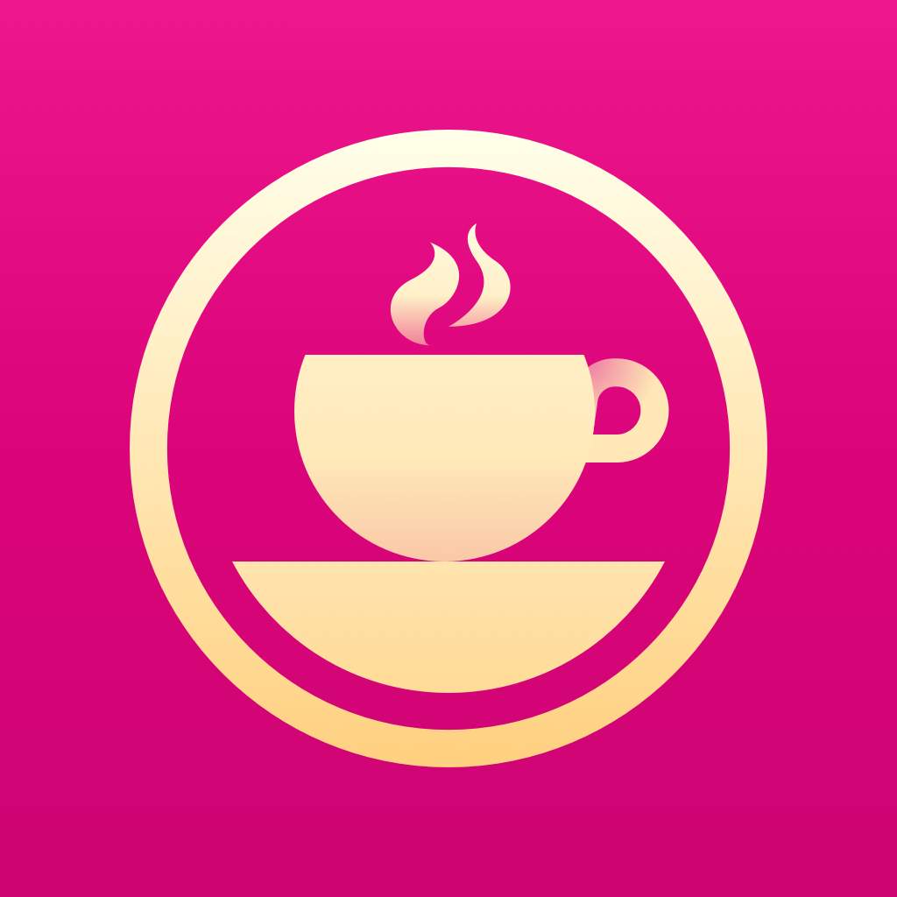

# Jinkyou Son

## Motto

<!-- 영어로도 작성할 것 -->
[A human is not perfect, but can be.](http://json.postype.com/post/119354/){:target="_blank"}

## Introduction

<!-- 5년차, 생각하는 개발자, 읽기와 쓰기를 좋아한다, 취향 탐색을 좋아한다 -->

I'm a 5 years experienced software engineer.\\
I started this career late, but really happy to do this job.\\
I used to study by myself and learn quickly.\\
I had wide range of experience at 2015, and now I want to be a specialist not a just generalist.

## Skills

- Backend

Phoenix(Elixir), Ruby on Rails, Node.js, Serverless(AWS Lambda)

- Frontend

Angular, Responsive web, Electron, jQuery

- DevOps

AWS, Docker, Heroku, Firebase

- Android

Kotlin, Reactive programming, MVVM

- iOS

Reactive programming, MVVM, Protocol-oriented programming

- Windows desktop application

C++, C#, OpenGL

<!-- Next step? -->
## Interesting

React, Elm, PWA, AMP, React Native

## Main Project

- **3DPRINT Connect** ([Youtube](https://youtu.be/0qFXxqwhWpw){:target="_blank"}) : 1.5 years\\
  CES 2016 Innovation Award
  
  - Project Canvas: 3D rendering engine with scene graph data structure (70%)

    Improvement of scene graph data structure\\
    Creating layer between application and renderer

  - Project Watson: C# based windows application (20%)

    Implementation of mesh selection and many commands\\
    Refactoring legacy codes\\
    Performance improvement

  - Project ADP: 3D mesh kernel (10%)

    Improvement of mesh instance (shared mesh)

  
  

- [**3DSystems onDemand**](http://qpe-staging.herokuapp.com/home) (6 months)

  Front-end layout with flexbox\\
  Connecting 3D viewer and its commands\\
  Cross browsing

  
  

- [**3DSPRINT Cloud**](http://www.3dsprint.com/) (4 months)

  Front-end

  

- **Stomit** (1 month)

  Exporting 3D mesh kernel with python script
  Docker
  Deploy to EC2

- **Cultrip** (3 months as a side job)

  [Android native application with Kotlin](https://play.google.com/store/apps/details?id=kr.co.cultrip.www.cultrip)\\
  Restful API server in Rails

  {:width="40%"}
  {:width="40%"}

- **OperaCoffee iOS App** (2 months)

  iOS native application with Swift\\
  MVVM, Protocol-oriendted programming

  {:width="40%"}
  {:width="40%"}

- **OperaCoffee Back Office** (2 months)

  Angular2 + Electron cross platform desktop app.\\
  Mobile first responsive web.

  {:width="65%"}
  {:width="25%"}

- **SecretVill Web** (1 month)

Angular

- **xxx Crawler Backend** (8 months)

Elixir, Deploying, Operation, AWS

## Toy Projects

- **Skelterlabs welcome kit** (5 days)

회사 처음 온 사람들을 위한 어쩌구
wifi 자동 예약, 각 직업군을 위한 안내 등

Angular, Electron

- **Memory Bot** (1 day)

Upload 1 picture to Slack every working day to 추억 회상

Node.js, AWS Lambda

- Windows Shutdown
http://maytrees.tistory.com/144

졸잼졸잼
윈도우즈 예약 종료
음악 들으면서 자던 중 원하는 프로그램 못찾아서 개발
볼륨 조정 기능! 볼륨 맛보기!

## **Career**

  

    

      <a class="board-title" href="https://skelterlabs.com/" target="_blank">
<b>Skelter Labs</b>
</a>
      
Software Engineer

      
2017.01. - 

      Elixir back-end
       
      DevOps
    

    

      
    

  

  

    

      <a class="board-title" href="http://operaproject.wixsite.com/home" target="_blank">
<b>OperaCoffee</b>
</a>
      
CTO

      
2016.05. - 2017.01.

      iOS Application
       
      Back Office
    

    

      
    

  

  

    

      <a class="board-title" href="https://www.facebook.com/1day1songapp" target="_blank">
<b>1Day1Song</b>
</a>
      
Software Engineer

      
2016.05. - 

      Android Application Maintenance
    

    

      
    

  

  

    

      <a class="board-title" href="http://www.cultrip.co.kr" target="_blank">
<b>Cultrip</b>
</a>
      
CTO

      
2016.01. - 2016.07.

    

    

      
    

  

  

    

      <a class="board-title" href="http://www.3dsystems.com" target="_blank">
<b>3DSystems Korea</b>
</a>
      
Software Engineer

      
2013.01. - 2016.04.

      Cloud Team (2015 - 2016)
       
      Print Core Team (2013 - 2015)
    

    

      
    

  

### **Education**

  

    

      <a class="board-title" href="http://www.snu.ac.kr" target="_blank">
<b>Seoul National University</b>
</a>
      
Mechanical and Aerospace Engineering, Master of Science (MS)

      
2011 - 2013

      
Human-Centered CAD Lab.

       
      
Publications

      
손진규, "3차원 구강 스캔 데이터를 이용한 덴탈 임플란트 크라운 자동 Transformation 알고리즘", 서울대학교 대학원, 2013.

      
손진규, 남성민, 양세웅, 이건우, “덴탈 CAD 시스템에서의 임플란트 크라운 자동 Transformation 알고리즘”, 한국CADCAM학회, 2013.

      
JinKyou Son, Seung-Yeob Baek, Kunwoo Lee, “Automatic Measurement of Dimensions of 3D Foot Scan Data”, 3D Body Scanning Technologies, 2012.

      
Seung-Yeob Baek, JinKyou Son, Kunwoo Lee, “Statistical Analysis of Foot Shapes for Designing Mass-Customized Footwear”, TMCE 2012, Tools and Methods of Competitive Engineering, 2012.

       
      
Project

      
<a href="https://simtk.org/home/lee-son/" target="_blank">Lee-Son's Toolbox: a Toolbox that Converts VICON Mocap Data into OpenSim Inputs</a>

      
<a href="https://vimeo.com/60218463" target="_blank">Wire Design using PS Move</a>

      
<a href="https://vimeo.com/22432532" target="_blank">SoundVisualizer: Human</a>

    

    

      
    

  

  

    

       <a class="board-title" href="http://www.snu.ac.kr" target="_blank">
<b>Seoul National University</b>
</a>
      
Mechanical and Aerospace Engineering, Bachelor of Science (BS)

      
2007 - 2011

       
      
Grants and Awards

      
<a href="http://www.idc-robocon.org/idc2008/e/" target="_blank">4th Rank from IDC ROBOCON, San Paulo, Brazil. (Aug. 2008)</a>

      
Outstanding Design Award from SNU Mechanical Design Contest. (Nov. 2007)

       
      
Club

      
Presidnet of RC Airplane Club 'Bulnabi' (2009)

      
Band 'Zither' (2007-2011)

    

    

      
    

  

  

    

       <a class="board-title" href="http://gafl.hs.kr" target="_blank">
<b>Gyeonggi Academy of Foreign Languages</b>
</a>
      
English, Japaness

      
2004 - 2007

    

    

      
    

  

### **Operation**

  

    <a href="https://www.facebook.com/groups/rxkorea" target="_blank">
      
      
RxKorea

    </a>
  

  

    <a href="https://www.facebook.com/groups/designersndevelopers" target="_blank">
      
      
DnD

    </a>
  

### **Open Source Contribution**

#### [Android Spinnerwhell](https://github.com/ai212983/android-spinnerwheel)

* [Add AbstractWheelCustomAdapter and setFriction](https://github.com/ai212983/android-spinnerwheel/pull/66)

#### [DefinitelyTyped](https://github.com/DefinitelyTyped/DefinitelyTyped)

* [[UnderScore] Update definitions of findIndex/findLastIndex](https://github.com/DefinitelyTyped/DefinitelyTyped/pull/9711)
* [[Underscore] Fix indentation](https://github.com/DefinitelyTyped/DefinitelyTyped/pull/9765)

#### [CNPPopupController](https://github.com/carsonperrotti/CNPPopupController)

* [Fix Swift project example](https://github.com/carsonperrotti/CNPPopupController/pull/55)

#### [Git-it](https://github.com/jlord/git-it-electron)

* [Korean translation](https://github.com/jlord/git-it-electron/pull/159)

#### [Isometric Contributions](https://github.com/jasonlong/isometric-contributions)

* [Fix for new github](https://github.com/jasonlong/isometric-contributions/pull/56)
* [Show isometric chart after changing years](https://github.com/jasonlong/isometric-contributions/pull/59)

#### [Zombie Microservices Workshop: Lab Guide](https://github.com/channy/aws-lambda-zombie-workshop)

* [Fix some old materials and typo](https://github.com/channy/aws-lambda-zombie-workshop/pull/1)

#### [Summernote Cleaner](https://github.com/StudioJunkyard/summernote-cleaner)

* [Don't show alert if notTime is less or equal to 0](https://github.com/StudioJunkyard/summernote-cleaner/pull/14)
* [Fix a bug (Pasting duplicates old content)](https://github.com/StudioJunkyard/summernote-cleaner/pull/15)

#### [Material Design for Angular](https://github.com/angular/material2)

* [feat(dialog): add result to MdDialogClose directive](https://github.com/angular/material2/pull/4332)

#### [HtmlEntities](https://github.com/martinsvalin/html_entities)

* [Replace deprecataed String.rstrip with String.trim_trailing](https://github.com/martinsvalin/html_entities/pull/13)

### **Activity**

  

    <a href="https://github.com/nallwhy" target="_blank">
      
      
Open Source

    </a>
  

  

    <a href="http://blog.weirdx.io/" target="_blank">
      
      
Weirdmeetup

    </a>
  

  

    <a href="http://kotlin.kr/" target="_blank">
      
      
Kotlin Korea

    </a>
  

  

    <a href="https://www.facebook.com/groups/1581001912175827/" target="_blank">
      
      
앱개발 고픈 사람들의 모임

    </a>
  

  

    <a href="https://developer.mozilla.org/ko/profiles/maytree" target="_blank">
      
      
MDN Translation

    </a>
  

  

    <a href="http://json.postype.com/" target="_blank">
      
      
Blogging

    </a>
  

### **Story**

1989\\
컴퓨터를 만지기 시작

1996\\
주변 사람들 컴퓨터를 고쳐주러 다님\\
아버지 친구 분 방직 공장 컴퓨터가 밤에 고장나서 공장이 멈췄을 때도 가서 고쳐드림

2001\\
공부하는 학원을 다닌 경험은 중학교 2학년 때 수학학원 한 달, 고3 때 수학 그룹과외 반년이 전부

2008
AOS 게임 카오스 Live배 1차 Team Dark 총 96팀 중 10강
대학 재학 중 대부분의 수업 프로젝트에서 1등
: 기계제도, 창의공학설계, 동역학, 설계/제조 및 실습, 기계항공시스템해석, 센서개론, 컴퓨터의 개념 및 실습, 최적설계

2010\\
컴퓨터의 개념 및 실습 수업을 듣고 프로그래밍에 큰 흥미를 느낌

2013\\
석사 졸업 후 개발직군 면접들에서 지금은 여기서 내가 제일 못하지만 1년만 지나면 제일 잘 할 것이라고하여 합격\\
신입 사원 교육 때 회사 제품에 대한 버그와 보완해야할 점 적어서 메일 보냄\\
신입 때 회사에서 2년 동안 안 풀리던 이슈 2주안에 해결

2014\\
사내에서 별명 '손수석'

2015\\
팀 변경 요청하여 Web front-end 개발을 시작\\
팀 내에서 사용하지 않고 있던 새로운 기술들을 적극 도입 (CSS Flexbox, Promise chain 등)

2016\\
Startup Cultrip 에서 처음으로 Android, Back-end 개발을 도전. 3개월 후 베타 테스팅\\
좋아하던 음악앱 1Day1Song 의 안드로이드 업데이트가 안되고 있는 것을 보고 대표님에게 연락해 직접 1년 반 만의 업데이트, 유저들의 호평이 쏟아짐\\
Startup OperaCoffee 에서 처음으로 iOS 개발을 도전, 2개월 후 출시\\
기술의 발전으로 점점 분야간의 문턱이 낮아짐에 따라 이제는 '커뮤니케이션 비용' > '협업을 위한 공부 비용' 이라고 생각하고, DnD 라는 그룹을 만들어 '협업하는 디자이너' 강의 기획 및 진행.